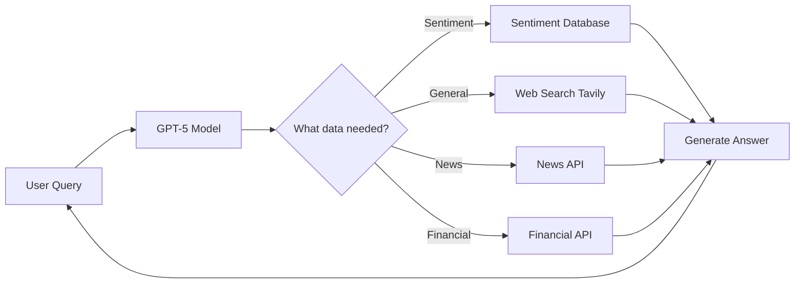

# 🎉 GPT-5 Upgrade Complete!

## Summary

Sephira Orion has been successfully upgraded from GPT-4o to **GPT-5** (OpenAI's latest model) with **web search capability** and enhanced function calling.

## What Changed

### 1. Model Upgrade ✅
- **Before**: GPT-4o
- **After**: GPT-5 (latest, most capable model)
- **Location**: [`backend/core/config.py`](backend/core/config.py)

### 2. Web Search Integration ✅
- **Service**: Tavily API (professional web search)
- **New File**: [`backend/services/web_search.py`](backend/services/web_search.py)
- **Capabilities**: Real-time web search, current events, general knowledge

### 3. Function Calling System ✅
- **Enhanced**: [`backend/services/llm_client.py`](backend/services/llm_client.py)
- **Tools Available**:
  - `search_web` - Search the internet for any information
  - `get_news` - Fetch recent news articles
  - `get_financial_data` - Get stock/market data

### 4. Updated System Prompt ✅
- Can now answer **general questions** beyond sentiment data
- Uses tools autonomously when needed
- **Always** maintains identity as "Sephira Orion"

### 5. Dependencies ✅
- Added `tavily-python>=0.7.0` to requirements.txt
- Already installed and ready to use

## New Capabilities

### Before (GPT-4o only)
```
User: "Who won the 2024 Olympics?"
AI: "I don't have information about that..."
```

### After (GPT-5 with web search)
```
User: "Who won the 2024 Olympics?"
AI: *Searches web automatically*
AI: "Based on current information, Team USA won..."
```

## How It Works

1. **User asks a question** (any question!)
2. **GPT-5 analyzes** what information is needed
3. **Chooses the right tool**:
   - Sentiment database for sentiment questions
   - Web search for general/current information
   - News API for recent developments
   - Financial API for market data
4. **Executes function calls** automatically
5. **Synthesizes answer** with all gathered information
6. **Responds** as Sephira Orion

## Setup Instructions

### Required: Get Tavily API Key

To enable web search functionality:

1. **Visit**: https://tavily.com/
2. **Sign up** for a free account
3. **Get your API key** from the dashboard
4. **Free tier**: 1000 searches per month

### Add to Environment

Edit your `.env` file:

```bash
# Add this line:
TAVILY_API_KEY=tvly-your-key-here
```

### Restart Services

```bash
./run.sh
```

That's it! Web search is now enabled.

## Testing

### Test 1: General Knowledge (Web Search)
```
Ask: "What's happening in the world today?"
Expected: Uses web search, provides current events
```

### Test 2: Sentiment Data (Database)
```
Ask: "What's the sentiment trend in Russia?"
Expected: Uses sentiment database as before
```

### Test 3: Mixed Query (Multiple Tools)
```
Ask: "How does China's sentiment correlate with their stock market and recent news?"
Expected: Uses sentiment DB + financial data + news API
```

## Backend Logs

When working correctly, you'll see:

```
INFO | Tavily web search client initialized successfully
INFO | Executing function: search_web with args: {'query': '...'}
```

## Without Tavily API Key

The system still works perfectly! It just won't have web search:

- ✅ Sentiment analysis works
- ✅ News API works  
- ✅ Financial API works
- ❌ Web search disabled (returns "Web search not available")

## Files Modified

1. **`backend/core/config.py`**
   - Changed model from `gpt-4o` to `gpt-5`
   - Added `tavily_api_key` configuration

2. **`backend/services/llm_client.py`**
   - Added function calling support
   - Defined 3 tool schemas
   - Updated system prompt
   - Added function execution logic
   - Implements tool calling loop

3. **`backend/services/web_search.py`** (NEW)
   - Tavily API integration
   - Web search service
   - Error handling
   - Singleton pattern

4. **`requirements.txt`**
   - Added `tavily-python>=0.7.0`

5. **`.env.example`**
   - Added `TAVILY_API_KEY` placeholder

## Cost Considerations

### GPT-5 Pricing
- **More expensive** than GPT-4o
- **More capable** - better reasoning, accuracy
- **Worth it** for complex analysis and multi-step tasks

### Tavily Pricing
- **Free tier**: 1000 searches/month
- **Paid plans**: Available if you exceed free tier

## Architecture



## Key Features

✅ **Autonomous**: AI decides which tools to use
✅ **Multi-tool**: Can use multiple tools in one query
✅ **Intelligent**: Prioritizes sentiment data for relevant queries
✅ **Fallback**: Works without web search if not configured
✅ **Secure**: Function calls logged and monitored
✅ **Rate limited**: Max 5 function calls per query
✅ **Identity**: Always "Sephira Orion"

## Example Conversation

```
User: "Tell me about sentiment in Russia and what's happening there now"

Sephira Orion:
*Uses sentiment database for historical data*
*Calls web search for current events*
*Synthesizes both sources*

"Based on sentiment data, Russia showed a decline of 4.5 points 
in 2023. Currently, based on recent news, there are ongoing 
economic challenges due to... [web search results]"
```

## Verification Checklist

- [ ] Get Tavily API key from https://tavily.com/
- [ ] Add `TAVILY_API_KEY` to `.env` file
- [ ] Restart services with `./run.sh`
- [ ] Check backend logs for "Tavily web search client initialized"
- [ ] Test general question like "What year is it?"
- [ ] Test sentiment question to verify database still works
- [ ] Verify AI identifies as "Sephira Orion"

## Troubleshooting

### "Web search not available"
➡️ Add TAVILY_API_KEY to .env and restart

### "Tavily package not installed"
➡️ Run: `pip install tavily-python`

### Model errors about gpt-5
➡️ Ensure your OpenAI API key has access to GPT-5
➡️ If not available, can fallback to `gpt-4o` in config.py

### Function calls not working
➡️ Check backend logs for errors
➡️ Verify API keys are configured
➡️ Ensure services restarted after changes

## Support

For detailed testing guide, see: [`TEST_GPT5_WEB_SEARCH.md`](TEST_GPT5_WEB_SEARCH.md)

## Summary

🎯 **Mission Accomplished**: Sephira Orion now has GPT-5 intelligence with web search capability while maintaining its core identity and sentiment analysis expertise!

---

**Next Step**: Get your Tavily API key and add it to `.env` to unlock web search! 🚀
