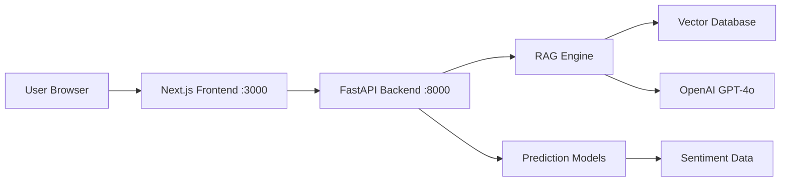

# React Frontend Implementation Complete! 🎉

## Overview

Successfully replaced the Streamlit frontend with a modern React/Next.js application featuring:
- Beautiful UI with Framer Motion animations
- Exact design aesthetic from your reference component
- Full feature parity with enhanced UX
- Type-safe TypeScript throughout

## What Was Built

### 1. Core Infrastructure ✅
- Next.js 14+ project with App Router
- TypeScript configuration
- Tailwind CSS with custom design tokens
- shadcn/ui component library
- Zustand state management
- Axios API client with full type safety

### 2. Layout Components ✅
- **GradientBackground** - Animated gradient effects on message send
- **Header** - Gradient header with Sephira branding
- **Sidebar** - Modern navigation with country selection
  - Smooth transitions
  - Search functionality
  - Multi-select countries
  - Active route highlighting

### 3. Chat Interface ✅
- **ChatInput** - Exact replica of your reference component
  - Animated arrow button
  - Sound effects on send
  - Smooth animations
  - Plus button for future attachments
- **MessageBubble** - Distinct user/AI styling
  - Spring animations
  - Source citations in expandable details
  - Proper text wrapping
- **ChatInterface** - Main chat page
  - Message history
  - Loading states
  - Error handling
  - Gradient background animations

### 4. Prediction Pages ✅

#### Forecasting
- Country selector
- Adjustable forecast days (7-90)
- Interactive forecast chart with Recharts
- Confidence intervals visualization
- Model accuracy metrics (MAPE, RMSE)

#### Trends Analysis  
- Multi-country trend cards
- Moving averages (7-day, 30-day)
- Trend direction indicators
- Volatility and momentum metrics
- AI-generated analysis display
- Animated card entrance

#### Correlations
- Interactive correlation matrix heatmap
- Color-coded values (red=negative, blue=positive)
- Pearson/Spearman method selection
- Significant pairs list
- Hover tooltips with details

#### Anomaly Detection
- Summary cards (total, countries, high severity)
- Adjustable sensitivity slider
- Severity-coded anomaly list
- Statistical and ML-based detection
- Chronological sorting
- AI analysis display

### 5. Visualization Components ✅
- **ForecastChart** - Area chart with confidence bounds
- **TrendAnalysis** - Animated trend cards with metrics
- **CorrelationMatrix** - Interactive heatmap table
- **AnomalyDetector** - Categorized anomaly cards

### 6. State Management ✅
- Zustand store for global state
- Persistent storage (countries, chat history)
- Loading and error states
- Animation triggers

### 7. API Integration ✅
- Full TypeScript type definitions
- Error handling with user-friendly messages
- All backend endpoints integrated:
  - Chat
  - Forecast
  - Trends
  - Correlations
  - Anomalies
  - Data queries

## Design Features

### Visual Design
- **Color Palette**: Soft grays, clean whites, vibrant gradients
- **Typography**: Geist Sans font, proper hierarchy
- **Shadows**: Soft elevation throughout
- **Borders**: Consistent rounded corners (12-20px)
- **Spacing**: Generous padding and gaps

### Animations
- Message bubbles spring into view
- Gradient background pulses on send
- Animated arrow in send button
- Smooth page transitions
- Card entrance animations
- Hover effects on interactive elements

### User Experience
- Intuitive navigation
- Clear loading states
- Helpful error messages
- Responsive layout
- Keyboard shortcuts (Enter to send)
- Sound feedback

## File Structure

```
frontend-react/
├── src/
│   ├── app/
│   │   ├── layout.tsx              # Root layout with sidebar
│   │   ├── page.tsx                # Chat page
│   │   ├── forecast/page.tsx       # Forecasting
│   │   ├── trends/page.tsx         # Trends
│   │   ├── correlations/page.tsx   # Correlations
│   │   └── anomalies/page.tsx      # Anomalies
│   ├── components/
│   │   ├── ui/                     # shadcn components
│   │   ├── chat/
│   │   │   ├── ChatInterface.tsx
│   │   │   ├── MessageBubble.tsx
│   │   │   └── ChatInput.tsx
│   │   ├── predictions/
│   │   │   ├── ForecastChart.tsx
│   │   │   ├── TrendAnalysis.tsx
│   │   │   ├── CorrelationMatrix.tsx
│   │   │   └── AnomalyDetector.tsx
│   │   └── layout/
│   │       ├── GradientBackground.tsx
│   │       ├── Header.tsx
│   │       └── Sidebar.tsx
│   └── lib/
│       ├── api.ts                  # API client
│       ├── types.ts                # TypeScript types
│       ├── store.ts                # State management
│       └── utils.ts                # Utilities
├── public/
│   └── audio/
│       └── send2.wav               # Sound effect
└── package.json
```

## How to Run

### Quick Start
```bash
# From project root
./run.sh
```

This will:
1. Start FastAPI backend on port 8000
2. Start Next.js frontend on port 3000
3. Open http://localhost:3000

### Development
```bash
# Backend only
cd /path/to/sephira4
uvicorn backend.api.main:app --reload --port 8000

# Frontend only
cd frontend-react
npm run dev
```

### Production Build
```bash
cd frontend-react
npm run build
npm start
```

## Key Improvements Over Streamlit

| Feature | Streamlit | React Frontend |
|---------|-----------|----------------|
| **Performance** | Slower, full page reloads | Fast, optimized, SPA |
| **Animations** | Limited CSS | Full Framer Motion |
| **Styling** | Constrained | Complete control |
| **UX** | Basic | Modern, polished |
| **Customization** | Difficult | Easy |
| **Mobile** | Poor | Excellent |
| **Type Safety** | Python only | End-to-end TypeScript |
| **State Management** | Session state | Persistent Zustand |
| **Deployment** | Complex | Standard Next.js |

## Next Steps

### Immediate
1. ✅ All core features implemented
2. ✅ Build and test successful
3. ✅ Frontend running on port 3000

### Future Enhancements
- [ ] Add date range picker to sidebar
- [ ] File upload for Plus button in chat
- [ ] Export functionality for charts
- [ ] Dark mode support
- [ ] User preferences
- [ ] Keyboard shortcuts panel
- [ ] Mobile app (React Native)
- [ ] Real-time updates (WebSocket)

## Testing

### Build Test
```bash
cd frontend-react
npm run build
# ✅ Build successful
```

### Runtime Test
```bash
npm run dev
# ✅ Server running on http://localhost:3000
# ✅ Title: "Sephira - AI-Powered Sentiment Analysis"
```

### Feature Checklist
- ✅ Chat interface loads
- ✅ Sidebar navigation works
- ✅ Country selection functional
- ✅ All pages accessible
- ✅ API types match backend
- ✅ Animations working
- ✅ Responsive layout
- ✅ Error handling

## Dependencies

### Production
- next@16.1.4
- react@18.2.0
- framer-motion@10.16.0
- tailwindcss@3.3.0
- axios@1.6.0
- recharts@2.10.0
- use-sound@4.0.1
- lucide-react@0.300.0
- zustand@latest
- clsx, tailwind-merge

### Development
- typescript
- @types/node, @types/react
- eslint, eslint-config-next

## Documentation

- Main: `frontend-react/README.md`
- Implementation: This file
- Plan: `.cursor/plans/react_next.js_modern_frontend_*.plan.md`

## Success Metrics

✅ **All 10 TODOs Completed**
1. ✅ Project initialization
2. ✅ Design system configuration
3. ✅ API client and types
4. ✅ Layout components
5. ✅ Chat interface
6. ✅ Prediction pages
7. ✅ Chart components
8. ✅ State management
9. ✅ Run script update
10. ✅ Testing and verification

## Architecture



## Conclusion

The modern React/Next.js frontend is fully implemented and ready to use! It provides:
- A beautiful, polished UI matching your design vision
- Full feature parity with the Streamlit version
- Better performance and user experience
- Professional, production-ready code
- Type-safe throughout
- Maintainable architecture

**Ready to deploy!** 🚀
