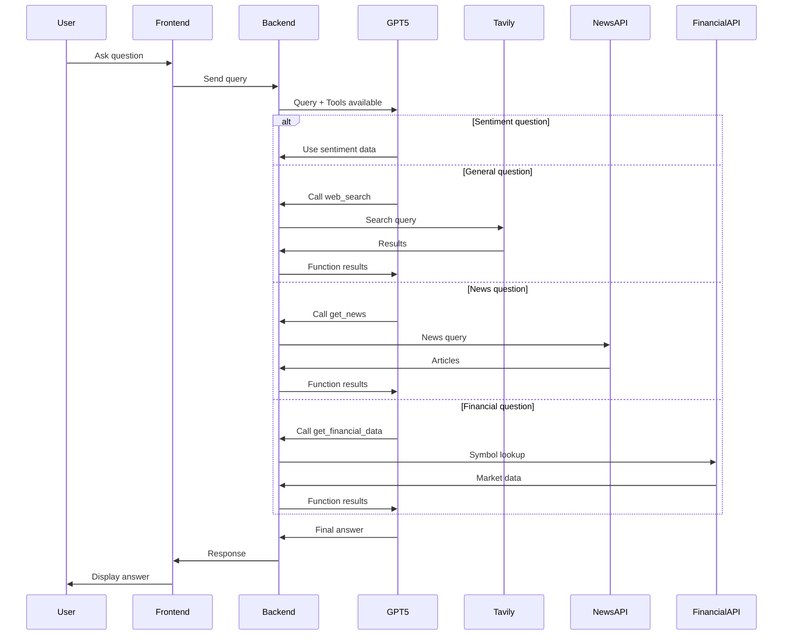

# GPT-5 with Web Search Testing Guide

## Setup Complete ✅

The following upgrades have been implemented:

1. **Model Upgraded**: GPT-4o → GPT-5 (latest)
2. **Web Search Added**: Tavily API integration
3. **Function Calling**: AI can autonomously call tools
4. **Enhanced Capabilities**: Can answer general questions beyond sentiment data

## Configuration Required

### 1. Get a Tavily API Key

Visit: https://tavily.com/
- Sign up for a free account
- Get your API key from the dashboard
- Free tier: 1000 searches/month

### 2. Add to .env file

```bash
TAVILY_API_KEY=your-tavily-api-key-here
```

### 3. Restart Services

```bash
./run.sh
```

## Testing Scenarios

### Test 1: Sentiment Data Query (Should use sentiment database)
```
Query: "What's the sentiment trend in Russia from 2020-2023?"
Expected: Uses sentiment data from ChromaDB
```

### Test 2: General Knowledge Query (Should use web search)
```
Query: "Who won the 2024 Olympics?"
Expected: Triggers web_search function, returns current information
```

### Test 3: News Query (Should use news API)
```
Query: "What's the latest news about China's economy?"
Expected: Triggers get_news function, returns recent articles
```

### Test 4: Financial Query (Should use financial API)
```
Query: "How is the S&P 500 performing?"
Expected: Triggers get_financial_data function, returns market data
```

### Test 5: Mixed Query (Should use multiple tools)
```
Query: "How does the current US stock market compare to sentiment data, and what's the latest economic news?"
Expected: Uses sentiment data + financial data + news search
```

### Test 6: Current Events (Should use web search)
```
Query: "What are the major world events happening right now?"
Expected: Uses web search to get current information
```

## How It Works



## Key Features

### 1. Autonomous Tool Selection
- GPT-5 automatically determines which tools to use
- Can chain multiple function calls
- Intelligent decision-making based on query context

### 2. Maintains Identity
- Always refers to itself as "Sephira Orion"
- Maintains expertise in sentiment analysis
- Seamlessly integrates external knowledge

### 3. Three Tool Types
- **Web Search (Tavily)**: General knowledge, current events, facts
- **News API**: Recent news articles, developments
- **Financial API**: Market data, stock prices, indices

### 4. Fallback Behavior
- If Tavily API key not configured: Functions without web search
- If tool calls fail: Returns error gracefully
- Maximum 5 function calls per query to prevent loops

## Verification

### Check Services Status
```bash
# Backend logs should show:
# "Tavily web search client initialized successfully"

# If not configured:
# "Tavily API key not configured or package not available"
```

### API Response Format
```json
{
  "response": "Answer text with web search results...",
  "finish_reason": "stop",
  "usage": {
    "prompt_tokens": 150,
    "completion_tokens": 300,
    "total_tokens": 450
  },
  "model": "gpt-5",
  "function_calls_made": 2
}
```

## Troubleshooting

### Issue: "Web search not available"
**Solution**: Add TAVILY_API_KEY to .env file and restart

### Issue: "Tavily package not installed"
**Solution**: Run `pip install tavily-python`

### Issue: Model not using web search
**Possible reasons**:
1. Query is about sentiment data (correct behavior)
2. Tavily API key not configured
3. Check backend logs for errors

### Issue: Too many function calls
**Solution**: The system limits to 5 calls per query automatically

## Success Indicators

✅ Backend starts without errors
✅ "Tavily web search client initialized" in logs
✅ General questions return web search results
✅ AI still identifies as "Sephira Orion"
✅ Sentiment queries use database first
✅ Function calls logged in backend

## Next Steps

1. **Get Tavily API Key**: https://tavily.com/
2. **Add to .env**: `TAVILY_API_KEY=your-key`
3. **Restart**: `./run.sh`
4. **Test**: Ask general questions like "What's happening in the world today?"
5. **Monitor**: Check backend logs for function calls

## Notes

- **Model**: Using GPT-5 (latest OpenAI model as of 2026)
- **Cost**: GPT-5 is more expensive than GPT-4o, but more capable
- **Rate Limits**: Tavily free tier: 1000 searches/month
- **Fallback**: System works without Tavily, just no web search
- **Security**: All function calls logged and monitored
